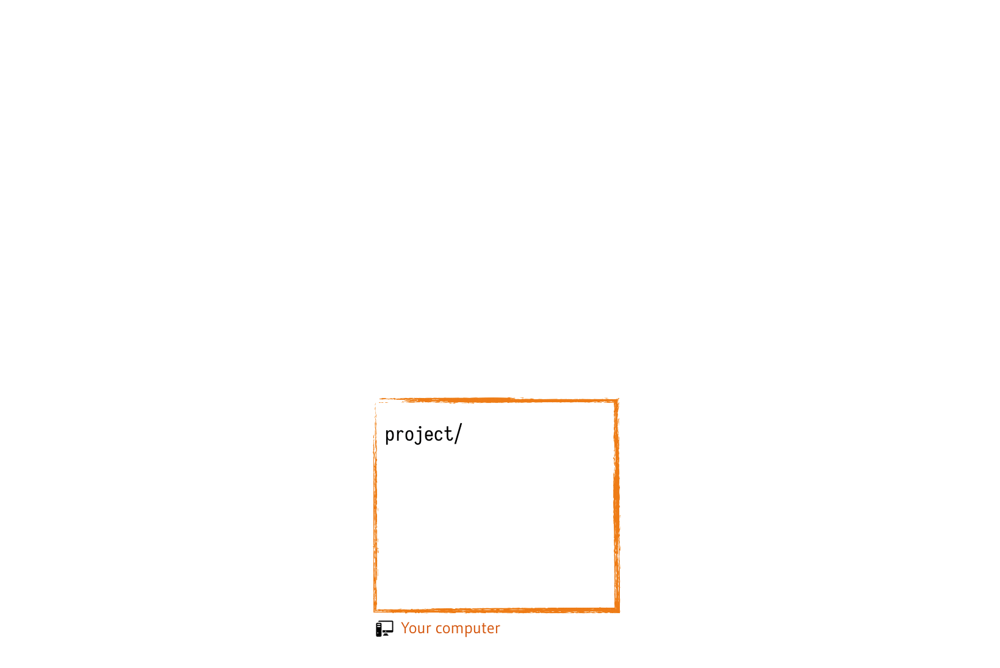
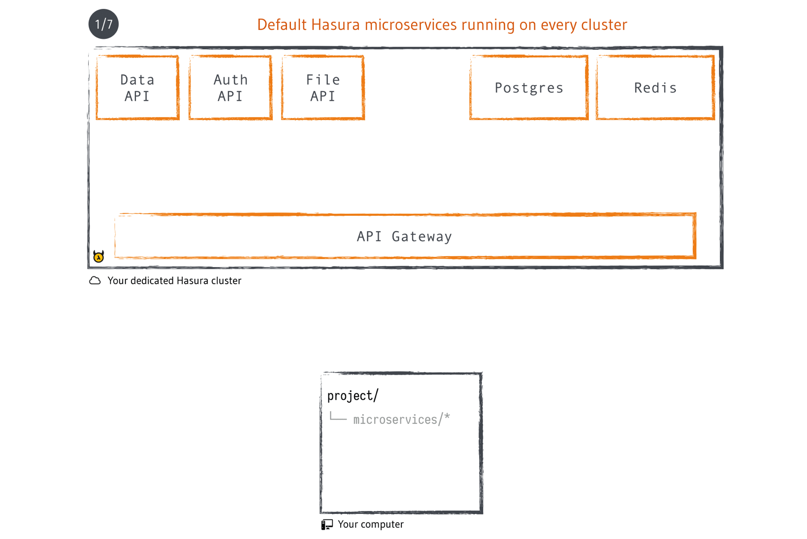
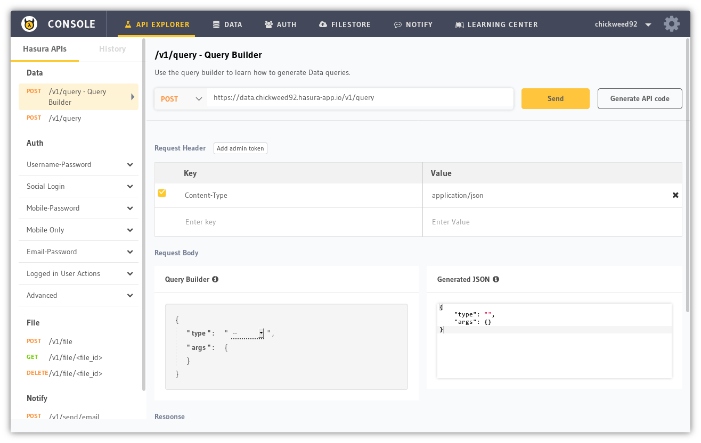
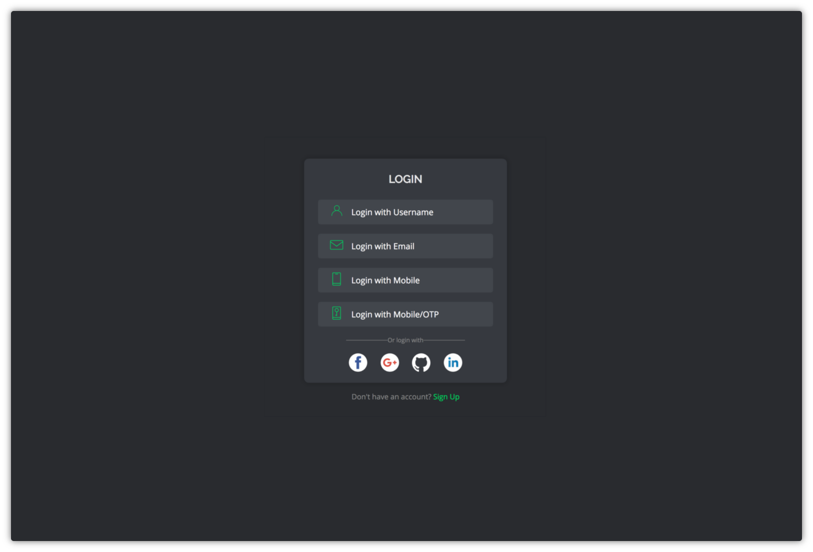

# hello-golang-gin

Boilerplate code for a [Gin Gonic](https://gin-gonic.github.io/gin/) (a full-featured web framework for [Golang](https://golang.org/)) project that can be deployed to the cloud with a git push (hosted on the [Hasura](https://hasura.io) free tier).

<!-- markdown-toc start - Don't edit this section. Run M-x markdown-toc-refresh-toc -->
**Table of Contents**

- [What's included?](#whats-included)
- [Getting started](#getting-started)
  - [Prerequisites](#prerequisites)
  - [Quickstart](#quickstart)
- [Making changes to code](#making-changes-to-code)
  - [Directory structure](#directory-structure)
  - [Edit](#edit)
  - [Deploy](#deploy)
  - [Debug](#debug)
- [Deploying your existing Gin app](#deploying-your-existing-gin-app)
- [Managing dependencies](#managing-dependencies)
  - [Adding a new Golang package](#adding-a-new-golang-package)
  - [Adding a new system package](#adding-a-new-system-package)
- [Local development](#local-development)
  - [With Docker](#with-docker)
  - [Without Docker](#without-docker)
- [Under the hood](#under-the-hood)
- [Adding a database](#adding-a-database)
  - [API Console](#api-console)
  - [Using Data APIs](#using-data-apis)
    - [Example](#example)
  - [Internal & External URLs](#internal--external-urls)
- [Adding authentication without any code](#adding-authentication-without-any-code)
  - [API gateway & session middleware](#api-gateway--session-middleware)
  - [Auth UI](#auth-ui)
    - [Restrict access to the entire app](#restrict-access-to-the-entire-app)
    - [Restrict access to certain APIs only](#restrict-access-to-certain-apis-only)
- [Next steps](#next-steps)

<!-- markdown-toc end -->

## What's included?

- [Gin Gonic](https://gin-gonic.github.io/gin/) web app boilerplate code with sample endpoints<!-- more info? -->
- [Glide](https://glide.sh/) for package management
- [codegangsta/gin](https://github.com/codegangsta/gin) for live reloading in local development

## Getting started

### Prerequisites

- [Hasura CLI](https://docs.hasura.io/0.15/manual/install-hasura-cli.html)
- [Git](https://git-scm.com/)
- [Docker](https://docs.docker.com/engine/installation/) or [Golang](https://golang.org/doc/install) (only for local development)

### Quickstart

```bash
# quickstart from this boilerplate
$ hasura quickstart hello-golang-gin

# git push to deploy
$ cd hello-golang-gin
$ git add . && git commit -m "First commit"
$ git push hasura master
```

Once deployed, access the app using the following command:

```bash
# open the gin app url in a browser
$ hasura microservice open app
```

## Making changes to code

### Directory structure

```bash
.
├── Dockerfile             # instructions to build the image
├── k8s.yaml               # defines how the app is deployed
├── glide.yaml             # lists dependent packages (handled by glide)
├── glide.lock             # locked versions of packages (handled by glide)
├── run-local-server.sh    # helper script to run local server
└── src
    └── main.go            # go source code

```

### Edit

Edit the code in `src/main.go`, for example, un-comment the commented lines:

```golang
package main

import "github.com/gin-gonic/gin"

func main() {
	r := gin.Default()
	r.GET("/", func(c *gin.Context) {
		c.JSON(200, gin.H{
			"message": "Hello from Gin on Hasura",
		})
	})

	// // un-comment the following lines
	//  r.GET("/ping", func(c *gin.Context) {
	//  	c.JSON(200, gin.H{
	//  		"message": "pong",
	//  	})
	//  })

	r.Run() // listen and serve on 0.0.0.0:8080 by default
	// set environment variable PORT if you want to change port
}
```

### Deploy

Commit and push to deploy again:

```bash
$ git add src/main.go
$ git commit -m "added new endpoint /ping"
$ git push hasura master

```

Checkout the new endpoint:

```bash
# open the url in browser
$ hasura microservice open app

# add /ping at the end of url
```

### Debug

If the push fails with an error `Updating deployment failed`, or the URL is showing `502 Bad Gateway`/`504 Gateway Timeout`, follow the instruction on the page and checkout the logs to see what is going wrong with the microservice:

```bash
# see status of microservice app
$ hasura microservice list

# get logs for app
$ hasura microservice logs app
```

Fix the errors and [deploy again](#deploy).

## Deploying your existing Gin app

- Replace contents of `src/` directory with your own source files
- Leave `k8s.yaml` and `Dockerfile` as it is (they are used by Hasura to deploy the app)
- Add your Go dependencies using `glide` (see [adding go dependencies](#adding-a-new-golang-package))
- Add any system dependencies by editing `Dockerfile` (see [adding system dependencies](#adding-a-new-system-package))
- If you do not want to use glide, remove both yaml and lock files and edit `Dockerfile` to remove any references to them
- If `src/` doesn't have a `main.go`, edit last few lines if `Dockerfile` to build and run the correct Go file

## Managing dependencies

### Adding a new Golang package

If you need to install a package, say `github.com/gin-contrib/authz`
```bash
# with docker

$ cd microservices/app
$ docker build -t hello-golang-gin-app .
$ docker run --rm -it -v $(pwd):/go/src/app \
             hello-golang-gin-app \
             glide get github.com/gin-contrib/authz


# without docker

$ cd microservices/app
$ glide get github.com/gin-contrib/authz
```
This will update `glide.yaml` and `glide.lock`.

### Adding a new system package

The base image used in this boilerplate is [golang:1.8.5-jessie](https://hub.docker.com/_/golang/). Hence, all debian packages are available for installation. You can add a package by mentioning it in the `Dockerfile` among the existing apt-get install packages.

```dockerfile
FROM golang:1.8.5-jessie

# install required debian packages
# add any package that is required after `build-essential`, end the line with \
RUN apt-get update && apt-get install -y \
    build-essential \
&& rm -rf /var/lib/apt/lists/*

...
```

## Local development

### With Docker

- Install [Docker CE](https://docs.docker.com/engine/installation/)

```bash
# go to app directory
$ cd microservices/app

# build the docker image
$ docker build -t hello-golang-gin-app .

# run the image using either 1 or 2

# 1) without live reloading
$ docker run --rm -it -p 8080:8080 hello-golang-gin-app

# 2) with live reloading
# any change you make to your source code will be immediately updated on the running app
# set CLUSTER_NAME
$ docker run --rm -it -p 8080:8080 \
             -v $(pwd):/go/src/app \
             -e CLUSTER_NAME=[your-cluster-name]
             hello-golang-gin-app \
             /scripts/run-local-server.sh

# app will be available at http://localhost:8080
# press Ctrl+C to stop the server
```

### Without Docker

- Install [Golang](https://golang.org/doc/install)
- Move the `hello-golang-gin` directory to your `GOPATH` and cd into the directory

```bash
# change to app directory
$ cd mircoservices/app

# install glide for package management
$ go get github.com/Masterminds/glide
# install gin for live reloading
$ go get github.com/codegangsta/gin

# set CLUSTER_NAME
$ export CLUSTER_NAME=[your-cluster-name]

# run the local server script
# windows users: run this in git bash
$ ./run-local-server.sh

# app will be available at http://localhost:8080
# any change you make to your source code will be immediately updated on the running app
# press Ctrl+C to stop the server
```

## Under the hood

Everything is declarative in a Hasura project. Your source code, configuration of clusters and database migrations are all applied and deployed in a simple `git push`.

 
 

Read more about the Hasura architecture [here](https://docs.hasura.io/0.15/manual/cluster/architecture.html).

## Adding a database

Hasura comes with a pre-configured ready-to-use PostgreSQL database, which can be contacted over HTTP JSON APIs. You can use this database from client side or server side just by making HTTP API calls with JSON data. There are no DB connection strings or ORMs to worry about.

### API Console

The best place to get started with APIs is [Hasura API Console](https://docs.hasura.io/0.15/manual/api-console/index.html).

```bash
# execute inside the project directory
$ hasura api-console
```

This command will run a small web server and opens up API Console in a new browser tab. There are already some tables created along with this boilerplate, like `article` and `author`. These tables were created using [migrations](https://docs.hasura.io/0.15/manual/data/data-migration.html). Every change you make on the console is saved as a migration inside `migrations/` directory.



### Using Data APIs

- Create required tables/columns using API Console (Data -> Schema)
- Use Query Builder under API Explorer and create the query
- Replicate the same JSON query in your gin app

<!-- commented until golang codegen is available
- Click on Generate API Code button and select Golang Requests
- Copy and paste the Go code into your Gin app source code
-->

#### Example

To get all entries from `article` table, the query would look like the following, using [levigross/grequests](https://github.com/levigross/grequests):

```golang
resp, err := grequests.Post("https://data.hasura/v1/query",
    &grequests.RequestOptions{
        JSON: map[string]interface{}{
            "type": "select",
            "args": map[string]interface{}{
                "table":   "article",
                "columns": []string{"*"},
            },
        },
    },
)
if err != nil {
    fmt.Printf("error: %s", err)
}
if !resp.Ok {
    fmt.Printf("status code: %d, data: %s", resp.StatusCode, string(resp.Bytes())),
}

fmt.Printf("response: %s", string(resp.Bytes()))
```

The output will be something similar to:

```json
[
    {
      "author_id": 12,
      "content": "Vestibulum accumsan neque et nunc. Quisque...",
      "id": 1,
      "rating": 4,
      "title": "sem ut dolor dapibus gravida."
    },
    {
      "author_id": 10,
      "content": "lacus pede sagittis augue, eu tempor erat neque...",
      "id": 2,
      "rating": 4,
      "title": "nonummy. Fusce fermentum fermentum arcu."
    }, 
    ...
  ]
```


### Internal & External URLs

Hasura APIs like data, auth etc. can be contacted using two URLs, internal and external. When your app is running inside the cluster, it can directly contact the Data APIs without any authentication. On the other hand, external URLs always go through the API Gateway, and hence special permissions will have to be applied over table for a non-authenticated user to access data.

- `http://data.hasura` - internal url
- `http://data.[cluster-name].hasura-app.io` - external url

*PS*: [Hasura Data APIs](https://docs.hasura.io/0.15/manual/data/index.html) are really powerful with nifty features like relationships, role based row and column level permissions etc. Using the APIs to their full potential will prevent you from re-inventing the wheel while building your app and can save a lot of time. 

*TIP*: Use `hasura ms list` to get all internal and external URLs available in your current cluster.

Read more about Data APIs [here](https://docs.hasura.io/0.15/manual/data/index.html).

## Adding authentication without any code

When your app needs authentication, [Hasura Auth APIs](https://docs.hasura.io/0.15/manual/users/index.html) can be used to manage users, login, signup, logout etc. You can think of it like an identity service which takes away all the user management headaches from your app so that you can focus on your app's core functionality.

Just like the Data APIs, you can checkout and experiment with the Auth APIs using [Hasura API Console](https://docs.hasura.io/0.15/manual/api-console/index.html).

Combined with database permission and API gateway session resolution, you can control which user or what roles have access to each row and column in any table.

### API gateway & session middleware

For every request coming through external URL into a cluster, the API gateway tries to resolve a user based on a `Cookie` or an `Authorization` header. If none of them are present or are invalid, the following header is set and then the request is passed on to the upstream service:

- `X-Hasura-Role: anonymous`


But, if the cookie or the authorization header does resolve to a user, gateway gets the user's ID and role from auth microservice and add them as headers before passing to upstream:

- `X-Hasura-User-Id: 3`
- `X-Hasura-Role: user`

Hence, other microservices need not manage sessions and can just rely on `X-Hasura-Role` and `X-Hasura-User-Id` headers.

`admin`, `user`, `anonymous` are three built-in roles in the Hasura platform.

### Auth UI

Hasura Auth APIs ship with a beautiful built-in user interface for common actions like login, signup etc. You can use these directly with your application and avoid building any user interface for logging in etc.

#### Restrict access to the entire app

Edit `conf/routes.yaml` and add the following lines to make the microservice accessible only to logged in users:

```yaml
authorizationPolicy:
  restrictToRoles: ["user"]
  noSessionRedirectUrl: https://auth.{{ cluster.name }}.hasura-app.io/ui/
  noAccessRedirectUrl: https://auth.{{ cluster.name }}.hasura-app.io/ui/restricted
```

Commit and push the new configuration:

```bash
$ git add conf/routes.yaml
$ git commit -m "restrict app to logged in users"
$ git push hasura master
```

Now, anyone who is not logged in will see a login prompt while visiting the microservice url.

```bash
# open the microservice url in a browser
$ hasura ms open app
```



#### Restrict access to certain APIs only

When you don't want to restrict access to entire app, but only to particular path/APIs, you can check for the header `X-Hasura-Role` and make a redirect if it is not what you require. For e.g. if you want to restrict access to `/profile` only to logged in users, the route can look like the following:

```golang
r.GET("/profile", func(c *gin.Context) {
    baseDomain := c.GetHeader("X-Hasura-Base-Domain")
    role := c.GetHeader("X-Hasura-Role")
    if role == "user" {
        userId := c.GetHeader("X-Hasura-User-Id")
        c.JSON(http.StatusOK, gin.H{
            "userId": userId,
        })
    } else {
        c.Redirect(http.StatusTemporaryRedirect,
            fmt.Sprintf(
                "http://auth.%s/ui?redirect_to=http://app.%s/profile",
                baseDomain, baseDomain,
            ),
        )
    }
})
```

When someone visits `app.[cluster-name].hasura-app.io/profile` and is not logged in, they'll be redirected to login screen and after logging in or signing up, they're redirected back to `/profile`.

Read more about Auth APIs [here](https://docs.hasura.io/0.15/manual/users/index.html).

## Next steps

- [Add another microservice](https://docs.hasura.io/0.15/manual/hasuractl/hasura_microservice_create.html)
